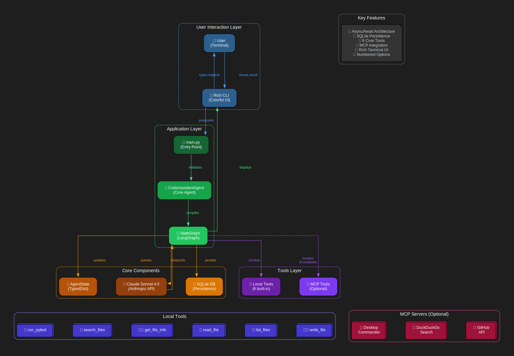

# 🤖 Claude Code Assistant

A minimalist AI coding assistant built with **LangGraph** and **MCP (Model Context Protocol)**. This project demonstrates how to create a functional coding assistant with a clean architecture, stripping away the complexity to understand the core concepts.



## Features

- **Dual LLM Providers**: Support for both **AWS Bedrock** (default) and **Anthropic Claude**
- **StateGraph Workflow**: Clean three-node architecture (user_input → model_response → tool_use)
- **Persistent State**: SQLite-based checkpointing for conversation history
- **Local Tools**: File operations, pytest integration, code search
- **MCP Integration**: Desktop Commander, DuckDuckGo, GitHub (optional)
- **Rich Terminal UI**: Colorful, hacker-style interface with emojis
- **AWS EC2 Ready**: Optimized for deployment with IAM role-based access
- **Debugging**: Full conversation history tracking in SQLite

## Quick Start

### Prerequisites

- Python 3.11+
- [uv](https://github.com/astral-sh/uv) (Python package manager)
- Docker (optional, for MCP servers)
- **AWS credentials** (for Bedrock - default) OR **Anthropic API key**

### Installation

1. **Clone and navigate to the project:**

```bash
cd claude-code-tool
```

2. **Set up environment variables:**

```bash
cp .env.example .env
# Edit .env - Bedrock is default, or set ANTHROPIC_API_KEY for Anthropic
```

**Option A: AWS Bedrock (Default - Recommended for EC2)**
```bash
# .env file
LLM_PROVIDER=bedrock
AWS_REGION=us-east-1
```

**Option B: Anthropic Claude**
```bash
# .env file  
LLM_PROVIDER=anthropic
ANTHROPIC_API_KEY=sk-ant-your-key-here
```

3. **Create virtual environment and install dependencies:**

```bash
# uv will automatically create .venv and install dependencies
uv sync
```

4. **Run the assistant:**

```bash
uv run main.py
```

## Usage

Once started, you'll see a colorful terminal interface. Try these commands:

### Basic Commands

```
help          - Display help information
tools         - List all available tools
exit/quit/q   - Exit the assistant
```

### Example Queries

```
"Show me the content of main.py"
"What tools do you have?"
"List all Python files in the current directory"
"Run the unit tests"
"Search for 'agent' in the codebase"
"Read the README file"
```

## Available Tools

### Local Tools (Built-in)

- **read_file**: Read file contents
- **list_files**: List directory contents
- **write_file**: Write content to a file
- **run_pytest**: Execute pytest tests
- **search_files**: Search for files by pattern
- **get_file_info**: Get detailed file information

### MCP Tools (Optional)

To enable MCP tools, you'll need to install the respective MCP servers:

#### Desktop Commander (File System Operations)
```bash
npm install -g @modelcontextprotocol/server-filesystem
```

#### DuckDuckGo (Web Search)
```bash
npm install -g @modelcontextprotocol/server-duckduckgo
```

#### GitHub (Repository Management)
```bash
npm install -g @modelcontextprotocol/server-github
# Set GITHUB_TOKEN in .env
```

#### Sandboxed Python (Docker-based)
```bash
# Build the Deno Docker image
docker build -t deno-docker:latest -f ./mcps/deno/Dockerfile ./mcps/deno
```

## State Persistence & Debugging

All conversations are saved in `checkpoints.db`. You can inspect the state:

```bash
# View recent writes
sqlite3 checkpoints.db "SELECT * FROM writes LIMIT 5"

# View checkpoints
sqlite3 checkpoints.db "SELECT * FROM checkpoints LIMIT 5"
```

## Configuration

### Environment Variables

Create a `.env` file with your preferred provider:

**AWS Bedrock (Default - Recommended for EC2):**
```bash
# LLM Provider
LLM_PROVIDER=bedrock

# AWS Configuration
AWS_REGION=us-east-1
BEDROCK_MODEL=anthropic.claude-3-5-sonnet-20241022-v2:0

# Optional: Customize behavior
LLM_TEMPERATURE=0.0
LLM_MAX_TOKENS=4096

# Optional: GitHub integration
GITHUB_TOKEN=your_github_token
```

**Anthropic Claude:**
```bash
# LLM Provider
LLM_PROVIDER=anthropic

# Anthropic Configuration
ANTHROPIC_API_KEY=sk-ant-your-api-key-here
ANTHROPIC_MODEL=claude-3-5-sonnet-20241022

# Optional: GitHub integration
GITHUB_TOKEN=your_github_token
```

### AWS Bedrock Setup

For AWS Bedrock (default provider), ensure you have AWS credentials configured:

1. **EC2 with IAM Role (Recommended):**
   - Attach an IAM role with `bedrock:InvokeModel` permissions
   - No additional configuration needed

2. **AWS Profile:**
   ```bash
   export AWS_PROFILE=your-profile-name
   ```

3. **Environment Variables:**
   ```bash
   AWS_ACCESS_KEY_ID=your-access-key
   AWS_SECRET_ACCESS_KEY=your-secret-key
   ```

See [AWS_BEDROCK_SETUP.md](./AWS_BEDROCK_SETUP.md) for detailed configuration guide.

### Customizing Tools

To add custom tools, edit `tools/local_tools.py`:

```python
from langchain_core.tools import tool

@tool
def my_custom_tool(param: str) -> str:
    """Tool description"""
    # Your implementation
    return result

# Add to get_local_tools()
def get_local_tools():
    return [
        # ... existing tools
        my_custom_tool,
    ]
```

## Project Structure

```
claude-code-tool/
├── main.py                 # Entry point
├── agent.py                # Core agent implementation
├── tools/
│   ├── __init__.py
│   ├── local_tools.py      # Local tool implementations
│   └── mcp_tools.py        # MCP tool integration
├── mcps/
│   └── deno/
│       └── Dockerfile      # Deno MCP container
├── pyproject.toml          # Dependencies
├── .env.example            # Environment template
├── .gitignore
└── README.md
```

## UI Customization

The assistant uses [Rich](https://github.com/Textualize/rich) for terminal UI. Customize the appearance in `agent.py`:

- Banner: `_display_welcome()`
- Colors: Modify the style strings (e.g., `[bold cyan]`)
- Panels: Adjust `Panel()` configurations

## Testing

The assistant includes pytest integration. To test:

```python
# Ask the assistant
"Run the unit tests"

# Or manually
uv run pytest -v
```

## Security Considerations

- **File Access**: By default, tools can access the entire filesystem. Consider restricting access in production.
- **Code Execution**: The sandboxed Python MCP runs in Docker/Deno for isolation.
- **API Keys**: Never commit `.env` files. Use environment variables.
- **Tool Permissions**: Review tool descriptions and limit sensitive operations.

## Contributing

Contributions are welcome! Areas for improvement:

- [ ] Add human-in-the-loop approval for destructive operations
- [ ] Implement RAG for personal notes (Notion, Obsidian)
- [ ] Add more MCP integrations
- [ ] Improve error handling and recovery
- [ ] Add conversation export/import
- [ ] Web UI interface

## How It Works

### StateGraph Flow

1. **User Input**: Collects user query
2. **Model Response**: Claude processes the input and decides whether to use tools
3. **Tool Use** (conditional): Executes tools if requested
4. **Loop**: Returns to model response with tool results, or back to user input

### Checkpointing

LangGraph's SQLite checkpointer saves the entire conversation state after each step:
- Enables conversation resume after crashes
- Facilitates debugging and analysis
- Supports multi-turn context retention

### MCP Integration

Model Context Protocol servers are spawned on-demand:
- Containers start when tools are invoked
- Process terminates after execution
- Minimal resource overhead
- Clean separation of concerns

## Resources

- [LangGraph Documentation](https://langchain-ai.github.io/langgraph/)
- [Model Context Protocol](https://modelcontextprotocol.io/)
- [Anthropic Claude API](https://www.anthropic.com/api)
- [Rich Terminal Library](https://github.com/Textualize/rich)

---

**Happy Coding! 🚀**

Questions or issues? Feel free to open an issue or contribute!
